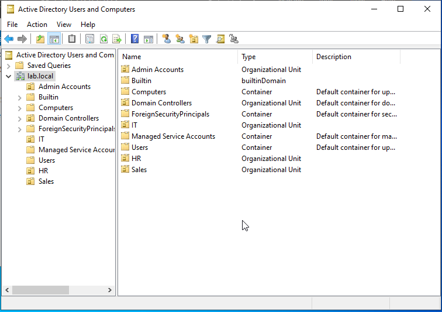
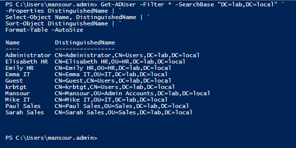
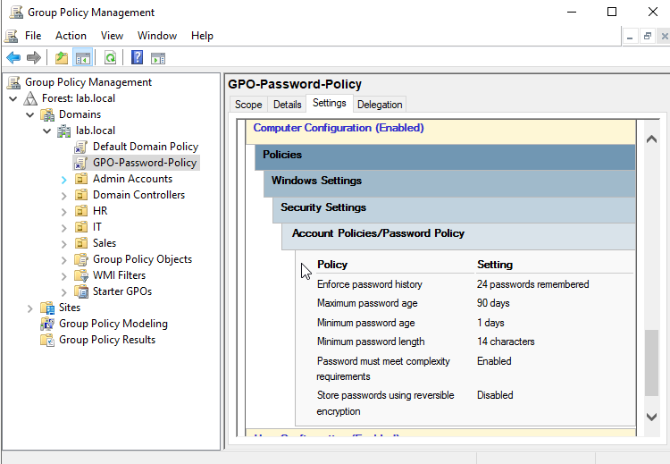
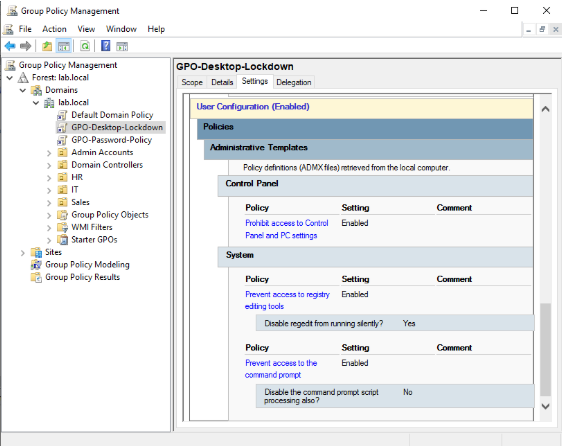
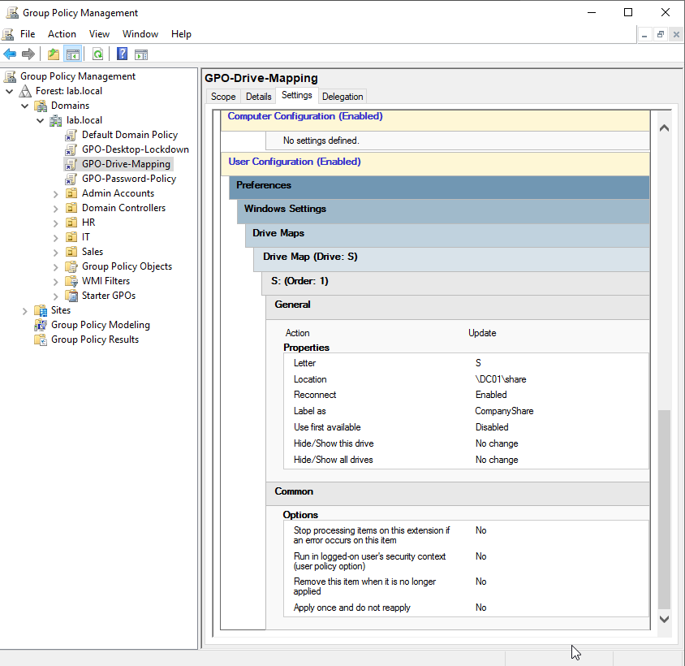
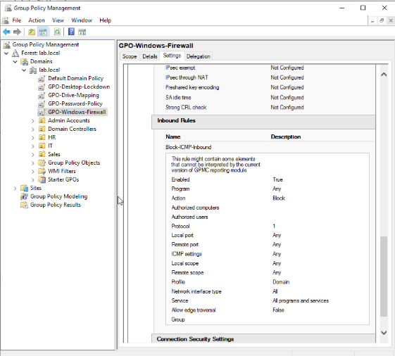
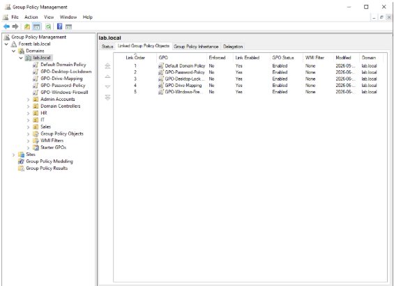

# AD User Management + GPOs

Active Directory users, OUs, and four Group Policy Objects deployed on [DC01 from Project 2](https://github.com/mansour-wade/Active-Directory-Domain-Controller). This is the identity and policy layer that every other project in the lab depends on. Domain join in Project 4 cannot happen without users. RDS in Project 6 cannot be tested without users. The drive mapping GPO will not fully work until Samba is deployed in Project 5, but the policy itself is created here.

No network changes in this project. DC01 is still on `10.0.3.10` behind the gateway. The topology is unchanged from Project 2.

---

## Table of Contents

- [What I Built](#what-i-built)
- [The Build](#the-build)
  - [1. OU Structure](#1-ou-structure)
  - [2. User Accounts](#2-user-accounts)
  - [3. GPO 1: Password Policy](#3-gpo-1-password-policy)
  - [4. GPO 2: Desktop Lockdown](#4-gpo-2-desktop-lockdown)
  - [5. GPO 3: Drive Mapping](#5-gpo-3-drive-mapping)
  - [6. GPO 4: Windows Firewall](#6-gpo-4-windows-firewall)
- [Security Decisions](#security-decisions)
- [What I Learned](#what-i-learned)
- [Build Order](#build-order)

---

## What I Built

I created the OU structure, populated it with domain users, and built four GPOs linked to `lab.local`. The password policy follows CIS Benchmark Level 1. The desktop lockdown restricts Control Panel, blocks registry editing, and blocks the command prompt on standard user accounts. The drive mapping pre-configures a network share path that will go live when Samba is deployed in Project 5. The firewall GPO blocks inbound ICMP on all domain endpoints, which adds an endpoint-layer control on top of the iptables rule that already blocks it at the network layer on the gateway.

This is not a tutorial follow-along. The GPO structure here is the same kind of baseline you would deploy before handing machines to users in a real environment.

---

## The Build

### 1. OU Structure

I opened Active Directory Users and Computers on DC01 and created four OUs directly under `lab.local`. Two of them, `Admin Accounts` and `IT`, already existed from Project 2. I added `Sales` and `HR` here.



The default `Users` container at the bottom of the tree stays empty. Users live in their department OU. That is the correct pattern and it is what makes GPO targeting and delegation work cleanly later.

---

### 2. User Accounts

I created two users per department OU, six accounts in total. I used a consistent `firstname lastname` naming convention and verified placement with PowerShell after creation so the OU path would be visible in one clean output.

```powershell
Get-ADUser -Filter * -SearchBase "DC=lab,DC=local" `
-Properties DistinguishedName | `
Select-Object Name, DistinguishedName | `
Sort-Object DistinguishedName | `
Format-Table -AutoSize
```



The output also shows `Administrator`, `Guest`, and `krbtgt` sitting in `CN=Users`. Those are default AD system accounts that exist in every domain. They are clearly distinguishable from the lab users by their Distinguished Name path.

---

### 3. GPO 1: Password Policy

I created `GPO-Password-Policy` in Group Policy Management and linked it to `lab.local`. The settings live under Computer Configuration because password policy is enforced by the DC at authentication time. It is a domain-level security setting, not a user preference. Putting it under User Configuration means AD silently ignores it.

Settings follow CIS Benchmark Level 1 and Microsoft's own security baseline:

| Setting | Value |
| :--- | :--- |
| Enforce password history | 24 passwords |
| Maximum password age | 90 days |
| Minimum password age | 1 day |
| Minimum password length | 14 characters |
| Password must meet complexity requirements | Enabled |
| Store passwords using reversible encryption | Disabled |



I linked it to the `lab.local` domain root and verified it takes precedence over the Default Domain Policy by confirming link order in GPMC.

The one-day minimum age is there to prevent users from changing their password immediately to cycle back to a favourite. Without it, password history is easy to bypass.

---

### 4. GPO 2: Desktop Lockdown

I created `GPO-Desktop-Lockdown` and linked it to `lab.local`. This one goes under User Configuration because the restrictions follow the user, not the machine. A Sales user who logs into any domain-joined machine gets the same lockdown applied.

| Setting | Value |
| :--- | :--- |
| Prohibit access to Control Panel and PC Settings | Enabled |
| Prevent access to registry editing tools | Enabled |
| Prevent access to the command prompt | Enabled |
| Disable command prompt script processing also | No |



The last setting is important. Setting "Disable command prompt script processing" to Yes would also block batch files, which would break logon scripts and the drive mapping GPO I am about to create. I left it at No so the restrictions hit interactive users without breaking automated processes.

One setting worth mentioning: some older GPO guides list Force classic Control Panel view as a recommended lockdown. That setting was removed from the Windows Server 2022 ADMX templates and does not exist in the current policy editor. The three restrictions above are the current equivalent and cover more ground anyway.

---

### 5. GPO 3: Drive Mapping

I created `GPO-Drive-Mapping` and linked it to `lab.local`. Drive mappings go under User Configuration because they follow the user across machines.

| Setting | Value |
| :--- | :--- |
| Action | Update |
| Location | \\10.0.1.2\share |
| Label | CompanyShare |
| Drive Letter | S: |
| Reconnect | Enabled |



The Samba share on Rocky Linux does not exist yet. It gets deployed in Project 5. The GPO will silently fail to map the drive until then, which is expected. Once the share is live, the drive maps automatically on login with no GPO changes needed.

---

### 6. GPO 4: Windows Firewall

I created `GPO-Windows-Firewall` and linked it to `lab.local`. Firewall rules apply to the machine, so this one goes under Computer Configuration.

I added a custom inbound rule blocking ICMPv4 on the Domain profile:

| Setting | Value |
| :--- | :--- |
| Rule name | Block-ICMP-Inbound |
| Protocol | ICMPv4 (Protocol 1) |
| Action | Block |
| Profile | Domain |
| Direction | Inbound |



This is the second layer of the same control. The iptables rule on the Ubuntu gateway already blocks DC01-initiated ICMP at the network layer. This GPO blocks it again at the endpoint. If someone bypasses the gateway rule, the endpoint drops it anyway. That is what defense in depth actually means in practice.

All four GPOs are linked to lab.local with Link Enabled and Status Enabled confirmed in GPMC. Policy application on domain-joined endpoints is verified in Project 4 via `gpresult /r` after Windows 11 joins the domain.



---

## Security Decisions

The desktop lockdown only applies when a GPO-affected user logs in. It does not touch accounts in `Admin Accounts` or `Domain Controllers`. I targeted `lab.local` rather than individual OUs deliberately, which means the lockdown applies to all standard users across Sales, IT, and HR without having to manage separate links per OU.

The ICMP block on the firewall GPO applies to the Domain profile only. That is intentional. Domain profile means the machine is on a network where it can reach a domain controller. There is no reason to extend this to Private or Public profiles in a domain environment where those profiles should not apply to managed endpoints anyway.

---

## What I Learned

Computer Configuration vs User Configuration is not just an organizational choice in the GPO editor. Password policy under User Configuration does nothing. AD ignores it there because password complexity and expiration are enforced at the domain level when the DC validates credentials, not when a user logs into a machine. I understood the concept before this project but seeing exactly where to navigate in the editor made it concrete.

The "Disable command prompt script processing" option inside the command prompt lockdown setting is easy to miss. Enabling it would have broken GPO 3 because drive mapping relies on a logon script process. The setting looks like it makes the lockdown stronger, but it actually breaks other policies. Knowing when not to enable something is as important as knowing when to enable it.

GPOs can reference infrastructure that does not exist yet. The drive mapping GPO points to a Samba share on Rocky Linux at `\\10.0.1.2\share` that I have not built. That is fine and it is how production environments work. Policies are often created before the systems they depend on are live.

---

## Build Order

This project has to be done before Project 4. Rocky Linux, Fedora, and Windows 11 need domain users to log in with after joining `lab.local`. All four GPOs need to be linked before domain join so `gpresult /r` in Project 4 can confirm they applied. GPO 3 becomes fully functional in Project 5 when Samba is deployed on Rocky Linux.

---

*Part of the [Hybrid Enterprise Lab](https://github.com/mansour-wade/Enterprise-Lab-Overview) — a connected enterprise lab built on bare metal Rocky Linux.*
